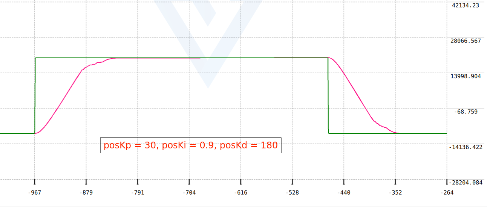
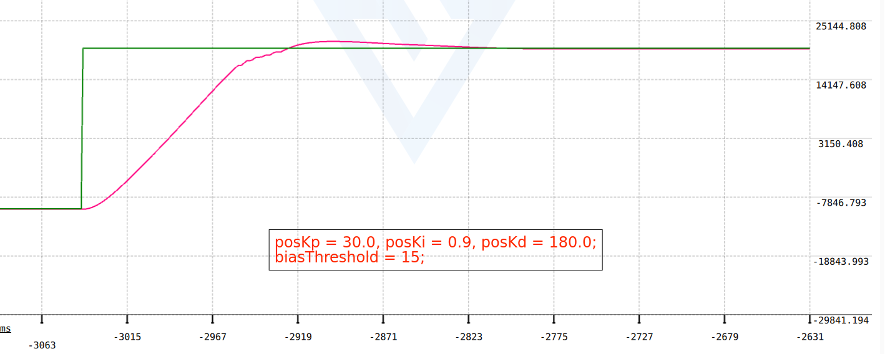
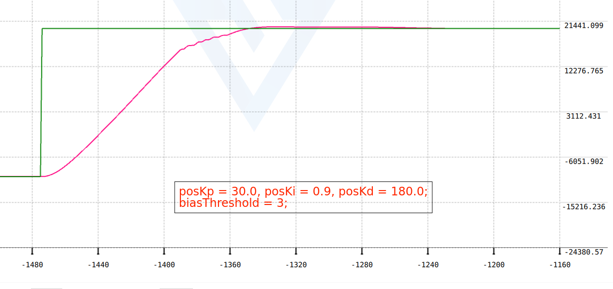

# STM32F401CCU6	位置式PI 位置环

## 硬件资源

- STM32F401CCU6主控
- 直流有刷电机
- 有刷电机驱动板
- 2路PWM：控制2个电机
- 2路中断：检测2个电机编码器的A相
- 2个GPIO输入：读取2个电机编码器的B相
- 4个GPIO输出：控制2个电机的方向

### 定时器分配

| 定时器 | 工作模式 | 功能 |
|:-:|:-:|:-:|
| TIM1 | 1kHz 2路PWM | 用于PWM控制2个直流有刷电机 |

### 中断分配

| 定时器 | 工作模式 | 功能 |
|:-:|:-:|:-:|
| EXTI0 | 上升沿触发  下拉 | 检测电机1编码器 |
| EXTI1 | 上升沿触发  下拉 | 检测电机2编码器 |

## 调试过程
由于我之前用矩阵键盘调过参数，Kp、Ki和Kd的参数已经比较优秀，我便没有再使用串口或者按键去调参，Kp、Ki和Kd的值如下表：

|Kp|Ki|Kd|
|:-:|:-:|:-:|
|30|0.9|180|

另外，采样时间是**1ms**。

调试出来的波形图如下:

我在这个调试中使用了「积分分离PID」，你也来试试吧（雾）。这是我大一上寒假刚开始学PID的时候自己想到的优化方法，当时并没有去了解抗饱和的方法，后来才了解到这个方法叫「积分分离PID」。我使用的阈值是500（我的电机转一圈单相有13000个脉冲）。

我之前想到的一个更好的算法：定义一个参数**差值阈值**，计算上一个差值与当前差值的差值，如果结果的绝对值小于**差值阈值**，才计算积分。这样可以避免因阻力较大而造成的稳差。

我在新的commit中实现了这个算法，发现其拥有更好的抗饱和能力，调试出的参数各为：

|Kp|Ki|Kd|差值阈值|
|:-:|:-:|:-:|:-|
|30|0.9|180|3|

其中，我发现该差值阈值越小，超调量越小。另外，这个算法也有一点缺陷，比如当阻力变化较大时，波形会跑到很远，然后后面调节的快慢与**差值阈值**成正相关。我想，后续可以结合「积分分离PID」和该自创的优化算法相结合，不过现在还没什么头绪（）。

调试出的波形：
差值阈值为15：

差值阈值为3：

